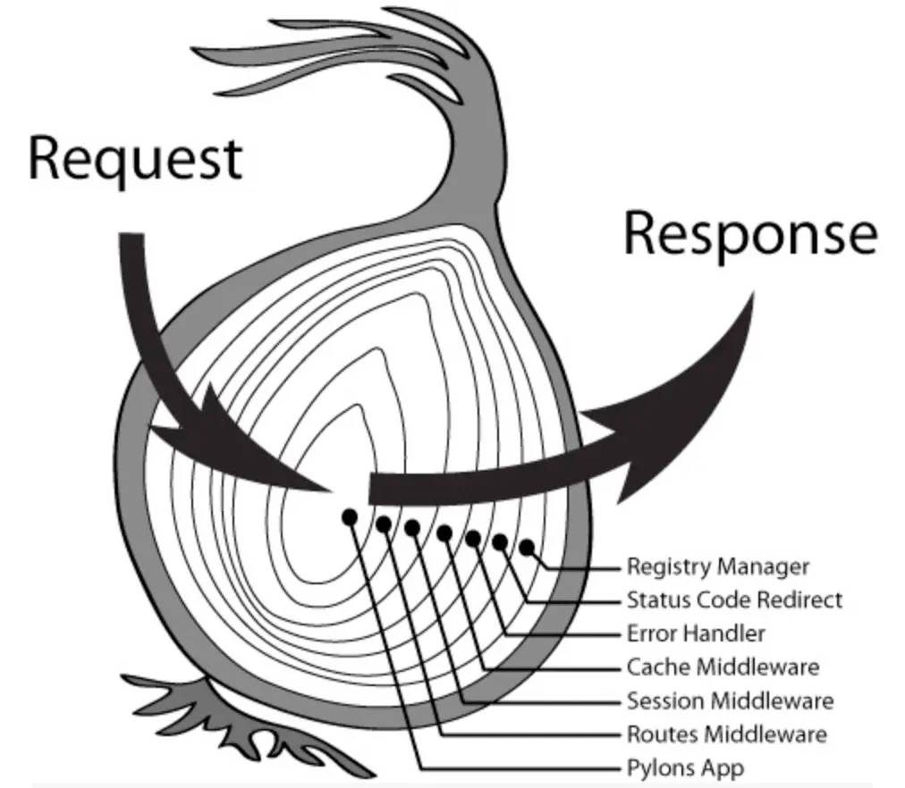

# 中间件



我们通过处理器衍生出的中间件机制，实现了有别于 `gin`、`echo`、`chi` 的洋葱模型，中间件之间按照编码顺序在栈内依次执行，
允许我们执行操作并向下传递请求（downstream），之后过滤并逆序返回响应（upstream）。

```go title=中间件函数签名
type MiddlewareFunc func(c Context, next HandlerFunc) error
```

## 前置中间件

前置中间件指的是使用方法 `Slim#Use()` 注册在 [Slim 实例](./core-concepts#slim-实例) 上的中间件。

```go
s.Use(slim.Logging())
s.Use(slim.Recover())
// .... 其它中间件
```

:::caution
前置中间件，不会参与到路由匹配，也就是说，在前置中间件中，我们不能使用如 `Context#RouteMatchType()`、`Context#RouteInfo()` 等与路由相关的方法。
:::


## 路由中间件

指的直接挂载在路由器上的中间件。

```go
r.Use(JWT("secret"))
r.Use(Auth("admin"))
// .... 其它中间件
```


## 路由组中间件

指的直接挂载在路由组上的中间件。

```go
r.Group(func(rc slim.RouteCollector) {
  rc.Use(JWT("secret"))
  rc.Use(Auth("admin"))
  // .... 其它中间件
})
```


## 路由中间件

指的直接挂载在路由上的中间件。

```go
r.GET("/", handler).Use(BasicAuth())
```
